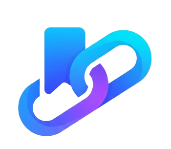

<p align="center">
  
</p>

# 🔖 Bookmark Manager

Solusi digital untuk menyimpan & mengatur semua link pentingmu di berbagai platform internet lalu diletakkan didalam satu tempat dengan tampilan modern dan cloud sync!

<p align="center">
  
  
  
  
</p>

---

## 🌟 Tentang Bookmark Manager

**Bookmark Manager** adalah aplikasi web yang memudahkan kamu menyimpan, mengelola, aplikasi ini cocok menyimpan link apapun di internet yang menurutmu diperlukan lagi ataupun referensi lain yang ingin kamu simpan agar tidak lupa. Semua data tersimpan di cloud, dan bisa diakses dari device manapun!

---

## ✨ Fitur Utama

### 📌 Tambah, & Hapus Bookmark
- **Tambah Bookmark Cepat** – Simpan link beserta judul, deskripsi, kategori/tag hanya dengan beberapa klik.
- **Edit & Hapus** – Kelola link dengan mudah, kapanpun.

### 🔎 Filter & Pencarian
- **Filter Kategori/Tag** – Temukan link sesuai kategori atau tag yang kamu buat.
- **Pencarian Real-time** – Cari bookmark berdasarkan judul, deskripsi, atau URL.

### ☁️ Cloud Sync
- **Supabase Storage** – Semua bookmark tersimpan di cloud, jadi tetap ada walau browser di-refresh.
- **Akses Multi-Device** – Bookmark bisa diakses dari mana saja, tidak terbatas di device tertentu.

### 🖼️ Preview Website
- Saat menambah bookmark, tampilkan preview website biar makin yakin dan simpel.

### 🔒 Autentikasi Aman
- Daftar & login dengan email, serta integrasi verifikasi email Supabase.
- Supabase Google Sign In Integration

---

## 🚀 Teknologi

- **Next.js (App Router)**
- **TypeScript**
- **Tailwind CSS**
- **Supabase (database & API)**

---

## ⚙️ Konfigurasi Environment Variables

Untuk menjalankan aplikasi ini, Anda perlu membuat file `.env.local` di root project dengan konfigurasi berikut:

```env
NEXT_PUBLIC_SUPABASE_URL=your_supabase_project_url
NEXT_PUBLIC_SUPABASE_ANON_KEY=your_supabase_anon_key
```

Untuk mengaktifkan Google Sign-In, Anda perlu:
1. Mengonfigurasi Google OAuth di Google Cloud Console
2. Memasukkan Client ID dan Secret di dashboard Supabase Authentication > Providers > Google

Untuk panduan lengkap setup Google Sign-In, lihat [GOOGLE_SIGN_IN_SETUP.md](GOOGLE_SIGN_IN_SETUP.md)

---

Bookmark Manager dibuat untuk bikin hidupmu makin mudah!  
Simpan, kelola, dan temukan semua link penting dengan satu aplikasi simpel.
